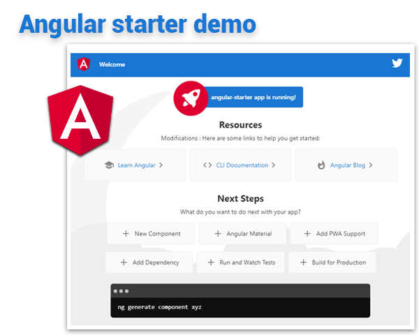

# Angular 12 Example Starter

* Featuring [**Angular 12.2.8**](https://github.com/angular/angular/releases) & [**Angular CLI 12.2.8**](https://github.com/angular/angular-cli/releases/)
* See the [**Live demo**](#live-demo), Test the repo with [**Quick start**](#quick-start) and for more read the [**Getting started**](#getting-started)

# [Live demo](#live-demo)

<p align="center">
  <a href="https://github.com/TerrenceMiao/Angular">
    
  </a>
</p>


# [Quick start](#quick-start)

```bash
# install the repo with npm
npm i

# start the server
npm start
```

in your browser go to [http://localhost:4200](http://localhost:4200)


# [Getting started](#getting-started)

## Installation
* `npm i` (installing dependencies)
* `npm outdated` (verifying dependencies)

## Development
* `npm start`
* in your browser go to [http://localhost:4200](http://localhost:4200)

## Production
* `npm run build`

## Tests
* `npm run test`

## Tests prerequisites
* ChromeDriver only supports Chrome version 89

# References
* Angular HTTP GET Example using httpclient, https://www.tektutorialshub.com/angular/angular-http-get-example-using-httpclient/
* Angular examples, https://github.com/angular/angular/tree/master/aio/content/examples
* Using Yarn With Angular, https://tutorialsforangular.com/2020/12/18/using-yarn-with-angular/
* GitHub GraphQL API, https://api.github.com/graphql
* GitHub GraphQL API Document, https://docs.github.com/en/graphql


* GraphQL Playground, https://github.com/graphql/graphql-playground


* Introduction to GraphQL with GitHub API - Understand the main advantages of GraphQL exploring the GitHub API, https://medium.com/swlh/introduction-to-graphql-with-github-api-64ee8bb11630
